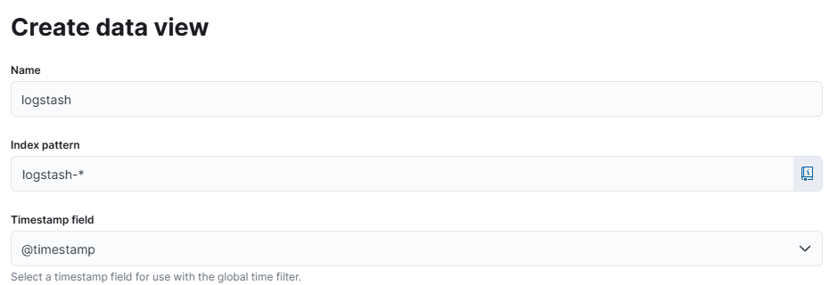
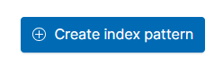

# EFK log centralizer with Kibana, Fluentd and SpringBoot

### TLDR
Run `docker-compose up` (it might take a while to pull all images/distributions)

Then `curl -i http://localhost:5000/v1/api/user`

Then access Kibana at http://localhost:5601/app/kibana#/home?_g=()

Look for

And access it. 

Then hit

And select indexes correspondent to `fluentd-*` and `logstash-*`

Dive into them, and you should be able to see the logs of the `user-management` SpringBoot app flowing within.

### Long version
WIP
